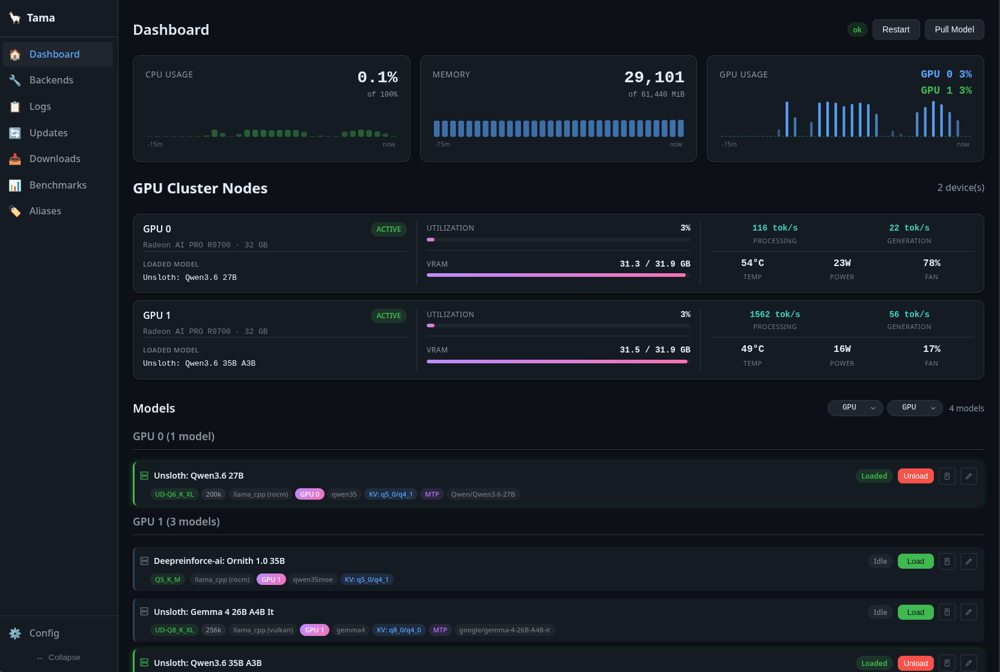

<div align="center">

# Tama

> A local AI server with automatic backend management, text-to-speech, and a web-based control plane

[](LICENSE)
[](https://www.rust-lang.org)
[](https://github.com/danielcherubini/tama/actions)

[Overview](#overview) • [Quick Start](#quick-start) • [Web UI](#web-ui) • [Configuration](#configuration) • [Architecture](#architecture)

</div>



## Overview

Tama is a local AI server written in Rust that provides an OpenAI-compatible API on a single port. It automatically manages backend lifecycles — starting models on demand, routing requests, and unloading idle models to save resources.

**Key features:**

- **OpenAI-compatible API** — Works with any client that supports the OpenAI API format
- **Text-to-Speech (TTS)** — Built-in Kokoro-FastAPI backend for speech synthesis via `/v1/audio/*` endpoints
- **Automatic backend management** — Starts, routes, and unloads llama.cpp/ik_llama backends on demand
- **Web-based control plane** — Browser UI for managing models, TTS backends, viewing logs, benchmarks, downloads, and editing configuration
- **GPU acceleration** — Supports CUDA, Vulkan, Metal, and ROCm
- **Linux support with native systemd integration**
- **Model optimization** — Automatically detects VRAM and suggests optimal quantizations and context sizes
- **Benchmarks** — Run llama-bench and speculative decoding benchmarks from the CLI or web UI
- **Downloads Center** — Persistent download queue with real-time progress tracking
- **Updates Center** — Per-quant update management with automatic version checking
- **Backup & Restore** — Create and restore full configuration backups (config, model cards, database)
- **Max loaded models** — LRU eviction to cap concurrent model loads
- **Multi-version backends** — Install and switch between multiple backend versions

---

## Quick Start

### Installation

**Linux (Debian/Ubuntu):**

```bash
sudo dpkg -i tama_*.deb
```

**Linux (Fedora/RHEL):**

```bash
sudo rpm -i tama-*.rpm
```

### Run Tama

Tama runs as a system service with a web-based control plane:

```bash
tama service install
tama service start
```

Then open [http://localhost:11435](http://localhost:11435) to access the web UI.

> [!TIP]
> On Linux, Tama creates a systemd user unit.

---

## Web UI

Tama includes a web-based control plane for managing models, viewing logs, and editing configuration from your browser.

### Running the web UI

The web server starts automatically alongside the proxy when using `tama service start`.

For development or manual startup:

```bash
cargo run --package tama
```

Open [http://localhost:11435](http://localhost:11435) to access the dashboard.

> [!NOTE]
> The web UI proxies all `/tama/v1/` requests to the running Tama proxy (default `http://127.0.0.1:11434`).

### Pages

- **Dashboard** — Resource monitoring tiles (CPU, memory, GPU, VRAM) with sparkline charts, active models list with status and quick-load buttons
- **Models** — View installed models, pull new ones from HuggingFace, edit model configurations, manage sampling profiles
- **Backends** — Manage llama.cpp and ik_llama installations, switch between versions, update to latest
- **Logs** — Real-time log streaming with filtering
- **Updates** — Check for model/backend updates, track per-quant update status, apply updates in queue
- **Downloads** — Persistent download queue with progress tracking, history, and toast notifications
- **Benchmarks** — Run llama-bench or speculative decoding benchmarks, select backends and presets, view results table (tokens, PP/TG speed)
- **Config Editor** — Edit the full configuration directly from the browser with validation

### Components

- **Model status tiles** — See which models are running, their active backends, quantization, context size, and lifecycle state (idle/loading/loaded/unloading/failed)
- **Sparkline charts** — Real-time CPU, memory, GPU, and VRAM usage graphs
- **Job log panel** — Shared component for streaming backend logs with terminal styling
- **Install modal** — Guided installation flow for models and backends
- **Model editor** — Full model configuration editing with quantization selector, context length, sampling templates, and pull wizard

---

## Configuration

Tama auto-generates a config on first run:

- **Linux:** `~/.config/tama/config.toml`

```toml
[backends.llama_cpp]
path = "/path/to/llama-server"
health_check_url = "http://localhost:8080/health"

[supervisor]
restart_policy = "always"
max_restarts = 10
restart_delay_ms = 3000
health_check_interval_ms = 5000

[proxy]
host = "0.0.0.0"
port = 11434
idle_timeout_secs = 300
startup_timeout_secs = 120

[max_loaded_models]
enabled = false
max = 5          # Maximum number of models loaded simultaneously (LRU eviction)
```

> [!NOTE]
> On first run after upgrading from kronk, Tama automatically migrates `~/.config/kronk` to `~/.config/tama`. Model configs are now stored in the SQLite database (`tama.db`) rather than `config.toml` — a migration runs automatically on upgrade.

### Directory layout

```
~/.config/tama/
├── config.toml              Main configuration (backends, proxy, supervisor)
├── tama.db                   SQLite database (models, backends, pulls, benchmarks)
├── configs/                 Model cards with quant info and sampling presets
│   └── bartowski--OmniCoder-8B.toml
├── models/                  GGUF model files
│   └── bartowski/OmniCoder-8B/*.gguf
├── backends/                llama.cpp and ik_llama binaries (versioned)
├── tts/                     TTS backend installations (Kokoro-FastAPI)
└── logs/                    Service logs
```

### GPU acceleration

The installer detects your GPU and offers these acceleration options:

- **CUDA** (NVIDIA) — Fast inference on NVIDIA GPUs
- **Vulkan** (AMD/Intel/NVIDIA) — Cross-platform GPU acceleration
- **Metal** (Apple Silicon) — Native macOS GPU acceleration
- **ROCm** (AMD) — AMD GPU support on Linux
- **CPU** — Fallback when no GPU is available

---

## Architecture

```
tama/
├── crates/
│   ├── tama-core/       # Config, process supervisor, proxy, platform abstraction
│   ├── tama-mock/       # Mock LLM backend for testing
│   └── tama/            # Main binary with web control plane (WASM + SSR)
├── config/              # Configuration templates
├── docs/                # Documentation
└── modelcards/         # Community model cards
```

### Core components

- **tama-core** — Config management, process supervision, backend registry, proxy server with streaming, database (SQLite), backup/restore, benchmark runner, download queue
- **tama** — Main binary combining the Leptos web control plane (WASM + SSR) with the proxy server
- **tama-mock** — Mock backend for testing and development

### How it works

1. `tama service start` launches the OpenAI-compatible API server on port 11434 alongside the web UI on port 11435
2. When a request arrives with `"model": "my-model"`, tama looks up the config from the database
3. If the backend isn't running, tama auto-assigns a free port and starts it
4. The request is forwarded to the backend and the response is streamed back
5. After `idle_timeout_secs` of inactivity, the backend is shut down

### Proxy endpoints

The proxy exposes OpenAI-compatible API endpoints:

- `/tama/v1/chat/completions` — Chat completions (streaming & non-streaming)
- `/tama/v1/completions` — Legacy completions
- `/tama/v1/models` — Model listing
- `/tama/v1/audio/*` — TTS endpoints (`/v1/audio/speech`, `/v1/audio/models`)
- `/tama/v1/embeddings` — Embeddings

All other non-tama paths are forwarded to the active backend via wildcard forwarding.

---

## Building from source

```bash
git clone https://github.com/danielcherubini/tama.git
cd tama
cargo build --release
```

The binary is at `target/release/tama`.

For development with the web UI:

```bash
# Install trunk for frontend builds
cargo install trunk

# Run in dev mode (proxy + web UI)
make run

# Or run the Leptos frontend dev server with hot reload
make dev
```

---

## Roadmap

- **System tray** — Quick service toggle from the system tray
- **Tauri GUI** — Lightweight desktop frontend
